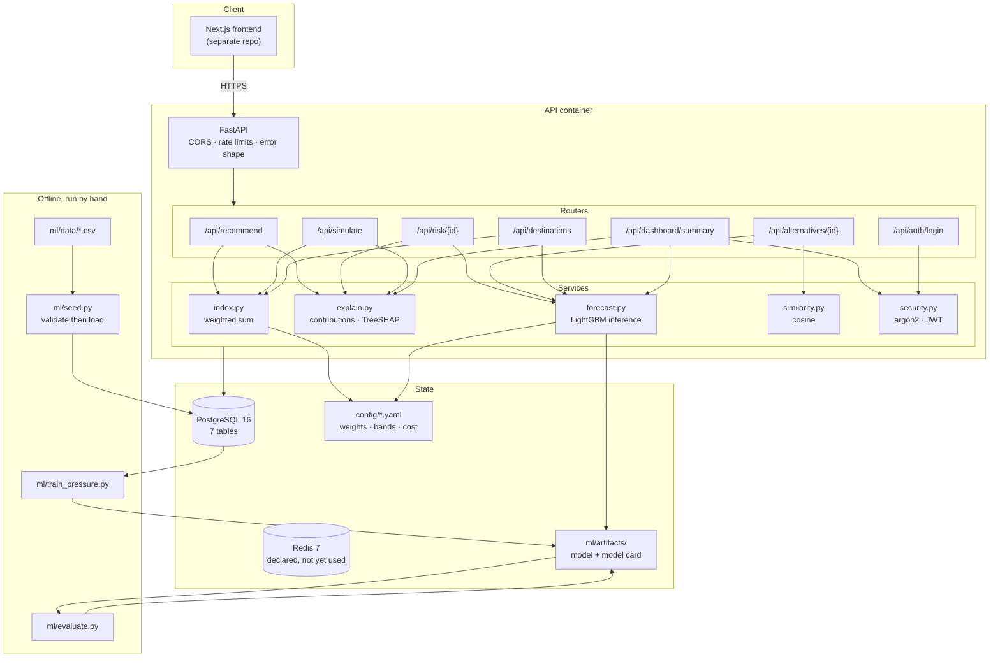

# CeylonTour — Backend

Decision support for sustainable travel in Sri Lanka. A tourist says what they
want from a trip; the API ranks destinations, shows exactly why each one scored
what it did, forecasts how busy each region will be, and offers quieter
alternatives when somewhere is under pressure. A second, authenticated view
gives tourism officials the same picture across every monitored destination.

**Team:** Blind Bandits, University of Moratuwa
**Competition:** CodeSplash '26, Theme 01 — Decision Support System Using
Explainable AI

## The two kinds of explanation

Everything in this project turns on one distinction, and the API labels it on
every number it returns:

| Kind | Where it comes from | `type` | Can it be reproduced by hand? |
|---|---|---|---|
| **Exact** | The Sustainability Index: a weighted sum | `"exact"` | Yes, from the weights and the factor values |
| **Estimated** | TreeSHAP on the LightGBM pressure model | `"estimated"` | No, it is a model's account of its own output |

Presenting these as equally certain would defeat the point of building an
explainable system. The UI renders them differently.

## Architecture



## Prerequisites

**Docker and Docker Compose. Nothing else.** No Python, no Postgres, no build
tools on the host. Verified on Docker 29 with Compose v5.

For running the tests or the training scripts outside a container you would
also need Python 3.11, but nothing in the steps below requires it.

## Clone to running

```bash
git clone https://github.com/Nipun-Bandara/ceylontour-bk.git && cd ceylontour-bk
```

```bash
cp .env.example .env
```

```bash
docker compose up --build
```

That is the whole thing. On first start `bootstrap.sh` waits for Postgres,
applies the migrations, loads the dataset from `ml/data/*.csv`, creates the
authority account if a password is set, trains a model if there is enough
history, and then serves the API.

```bash
curl http://localhost:8000/health
```

```json
{"data":{"status":"ok"},"meta":{"model_version":"pressure-v1.2","index_version":"weights-v1"}}
```

Interactive docs are at <http://localhost:8000/docs>.

### If a port is already in use

`DB_PORT`, `REDIS_PORT` and `API_PORT` in `.env` set the **host** ports only.
Containers always talk to each other on 5432, 6379 and 8000, so changing these
is safe.

### What works before the model is trained

`ml/data/` ships three example destinations and one month of history, which is
not enough to train on. Bootstrap says so loudly and starts anyway.
`/api/recommend`, `/api/simulate`, `/api/auth/login` and `/health` all work.
`/api/risk`, `/api/alternatives`, `/api/destinations` and the dashboard answer
**503** with a message explaining why, rather than inventing a number. They
start working as soon as real history is loaded and the model is trained.

## Production

```bash
docker compose -f docker-compose.prod.yml up --build -d
```

The differences from the development stack:

- The API runs **gunicorn with uvicorn workers**, not a reloading server.
- It runs as a **non-root user** (`app`, uid 1000).
- **Nothing is mounted from the host.** The image is the deliverable.
- **Postgres and Redis publish no host ports.** Only the API reaches them.
- Model artefacts live in a named volume, so a retrain survives a rebuild.
- A container healthcheck polls `/health`.

Set these in `.env` before deploying, or the app refuses to start:

```
ENVIRONMENT=production
JWT_SECRET=<generate one>
CORS_ORIGINS=["https://your-frontend-domain"]
```

```bash
python -c "import secrets; print(secrets.token_urlsafe(48))"
```

In production the settings validator rejects a placeholder `JWT_SECRET`, a
`"*"` CORS origin, and any plain `http://` origin.

## Environment variables

`.env` is gitignored; `.env.example` is committed and lists every one.

| Variable | Default | What it does |
|---|---|---|
| `ENVIRONMENT` | `development` | `production` turns on the startup safety checks |
| `DATABASE_URL` | bare host, no credentials | Postgres connection string |
| `REDIS_URL` | `redis://cache:6379/0` | Redis connection string |
| `MODEL_VERSION` | `pressure-v1.2` | Placeholder in `meta`; the risk endpoint reports the real artefact version |
| `INDEX_VERSION` | `weights-v1` | Superseded at runtime by the `version` in `config/weights.yaml` |
| `CORS_ORIGINS` | `["http://localhost:3000"]` | JSON list of exact frontend origins. Never `["*"]` |
| `JWT_SECRET` | `change-me` | Token signing key. Production refuses to start on the default |
| `JWT_ALGORITHM` | `HS256` | Token algorithm |
| `JWT_EXPIRE_MINUTES` | `30` | Token lifetime |
| `AUTHORITY_EMAIL` | `authority@ceylontour.lk` | Login for the dashboard account |
| `AUTHORITY_PASSWORD` | empty | Set it to create the account. Blank or under 12 characters is refused |
| `RATE_LIMIT_RECOMMEND` | `60/minute` | Per-client limit on `/api/recommend` |
| `RATE_LIMIT_RISK` | `120/minute` | Per-client limit on `/api/risk` |
| `MAX_REQUEST_BYTES` | `65536` | Larger bodies get a 413 |
| `POSTGRES_USER` / `_PASSWORD` / `_DB` | none | Read by the Postgres image. Compose refuses to start without them |
| `DB_PORT` / `REDIS_PORT` / `API_PORT` | `5432` / `6379` / `8000` | Host ports only |
| `GUNICORN_WORKERS` | `2` | Production worker count |

## Tests

Run them inside the container; the database-backed ones need Postgres.

```bash
docker compose exec api pytest
```

They also run on the host, but the database-backed ones **skip** rather than
fail when Postgres is down, so a green run there does not mean everything ran.
Check the skip count.

```bash
python -m venv .venv && .venv/bin/pip install -r requirements.txt && .venv/bin/pytest
```

```bash
.venv/bin/ruff check .
```

## The dataset

Three CSVs in `ml/data/`, loaded by `python -m ml.seed`, which validates all
three and writes nothing at all if any row fails. See `ml/data/README.md` for
the column formats and where each value comes from.

**The rows committed today are examples with invented numbers**, and every
`source_ref` says so. They exist so the loader has something to run against.

## Retraining the model

After loading real history into `region_pressure_history`:

```bash
docker compose exec api python ml/train_pressure.py
```

```bash
docker compose exec api python ml/evaluate.py
```

```bash
docker compose restart api
```

The restart matters: the API loads the model once per process and caches every
forecast, so it keeps serving the old model until it restarts.

Training holds out the most recent full calendar year and never sees it. It
refuses to run if no region has 13 consecutive months, because the lag-12
feature would not exist.

### Where the model card lives

**`ml/artifacts/model_card.md`**, written by `ml/evaluate.py`. It records what
the model predicts, the data and its date range, the features, the model's MAE
and RMSE against a seasonal-average baseline, whether it beat that baseline,
and its limitations.

It is **gitignored on purpose**: a model card is only true of the data it came
from, and committing one produced from example rows would put accuracy numbers
in the repository that nobody measured. `ml/artifacts/README.md` explains how
to regenerate it.

If the model loses to the baseline the card says so plainly. That is
deliberate, and the demo should repeat it.

## The authority login

```bash
docker compose exec api python -m api.seed_user
```

Reads `AUTHORITY_EMAIL` and `AUTHORITY_PASSWORD`, hashes with argon2, and
refuses a blank or under-12-character password. Re-running updates the password
rather than creating a second account. Bootstrap runs this automatically when a
password is set.

A tourist-role account can log in but gets a 403 from the dashboard; no token
gets a 401.

## Endpoints

Every success is wrapped:

```json
{ "data": {}, "meta": { "model_version": "...", "index_version": "..." } }
```

Every failure returns the matching status plus:

```json
{ "error": { "code": "...", "message": "..." } }
```

| Method | Path | Purpose | Auth |
|---|---|---|---|
| GET | `/health` | Liveness | — |
| POST | `/api/recommend` | Ranked destinations, scores, contributions, explanation | — |
| GET | `/api/destinations` | Every destination with coordinates, score and band | — |
| GET | `/api/destinations/{id}` | One destination in full, including `source_ref` | — |
| GET | `/api/risk/{id}?month=` | Pressure forecast, band, TreeSHAP breakdown | — |
| GET | `/api/alternatives/{id}` | Up to 3 similar, lower-pressure destinations | — |
| POST | `/api/simulate` | The index re-run with adjusted inputs | — |
| GET | `/api/dashboard/summary` | Authority overview | **authority** |
| POST | `/api/auth/login` | JWT for authority users | — |

## Layout

```
api/
├── main.py          # app, CORS, rate limits, error handlers, /health
├── config.py        # settings, plus the production safety checks
├── rate_limit.py    # the shared limiter
├── envelope.py      # the {"data", "meta"} helper
├── database.py      # engine and session factory
├── seed_user.py     # create the authority account
├── routers/         # one module per endpoint group
├── services/        # index, explain, forecast, similarity, security
├── schemas/         # Pydantic request and response models
├── migrations/      # Alembic
└── tests/
ml/
├── seed.py          # validate the CSVs, then load them
├── features.py      # feature engineering for the pressure model
├── train_pressure.py
├── evaluate.py      # metrics and the model card
├── data/            # the dataset, plus where each value came from
├── artifacts/       # generated model files, gitignored
└── tests/
config/
├── weights.yaml     # index weights and the preference shift
├── cost_bands.yaml  # budget each cost band needs
└── bands.yaml       # traffic-light thresholds for visitor pressure
docs/
├── DEMO.md          # the click path for the live demo
└── explain/         # one note per branch, in plain English
bootstrap.sh         # migrate, seed, train, serve
```

## Documentation

- `docs/DEMO.md` — the exact click path for the demo
- `docs/explain/` — what each branch built and why, one file per branch
- `ml/data/README.md` — dataset columns and sources
- `ml/artifacts/model_card.md` — generated; what the model can and cannot do
- `THIRD_PARTY.md` — every dependency with its licence
- `plan.md`, `features.md` — the build plan and the feature specification
